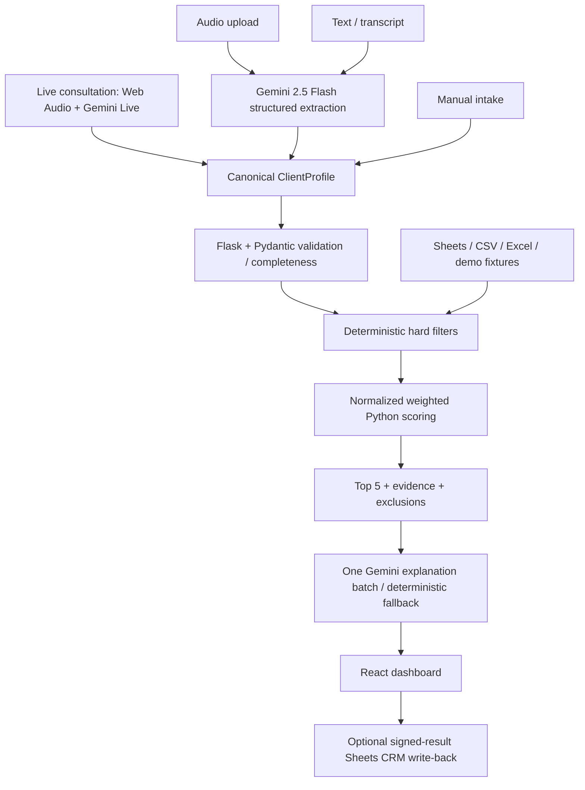

# Haven · Senior Living Placement Assistant V2

A React + Flask advisor workspace that turns consultations into reviewed client profiles and auditable community shortlists. **Gemini understands and explains; deterministic Python decides eligibility, scores and final order.**

## Architecture



Frontend: React 19, TypeScript, Vite 7, Tailwind 4. Backend: Python 3.11+, Flask 3, Flask-CORS, Pydantic 2, Pandas, Google GenAI SDK, gspread and geopy. There is no agent framework, vector database, queue or additional database.

The original community fixtures, spreadsheet schema, business tiers, budget regex behavior, geographic utilities and regression tests were reused. Streamlit and OpenAI runtime dependencies were removed. `src/` contains compatibility/regression utilities; the API always uses `backend/ranking.py` for final recommendations.

## Run the offline demo

```bash
python -m venv .venv
source .venv/bin/activate
# Windows PowerShell instead: .venv\Scripts\Activate.ps1
pip install -r requirements-dev.txt
python -m flask --app backend.wsgi run --port 5000
```

In another terminal, with Node 22.12+:

```bash
cd frontend
npm ci
npm run dev
```

Open `http://localhost:5173` and choose **Launch Demo**. It loads the existing synthetic Margaret Johnson consultation and 15 synthetic communities, runs real filters/ranking, and returns Top 5 with evidence. Runtime needs no Gemini key, Google credentials, microphone or external API. Dependency installation requires internet access.

If a restricted Windows environment blocks Vite's development optimizer, use `npm run build` and `npm run preview -- --port 5173`. Browser tests use this production preview too.

## Four intake modes

| Mode | Behavior |
| --- | --- |
| Live consultation | PCM microphone input, Gemini Live transcription, validated profile updates, deterministic missing questions, AI guidance; conversation playback or silent agent assist |
| Audio upload | Native Gemini understanding for MP3/WAV/M4A/WEBM/OGG/FLAC, 10 MB limit, extension/signature validation, request-scoped bytes |
| Text / transcript | Structured Gemini output, Pydantic validation, at most two attempts, partial budget fallback with visible warnings |
| Manual intake | Direct canonical profile validation, without an extraction AI call |

All modes require advisor review. Missing care, budget or location blocks recommendations; timeline is encouraged. Editing a profile clears stale results. Mobility/other preferences are captured but not scored without corresponding data.

Offline text performs **budget-only regex extraction**, not simulated AI understanding. Offline live is a labeled sample simulation. Real voice and uploaded audio understanding require credentials.

## Deterministic ranking

Hard exclusions are unsupported/unknown care, unconfirmed mandatory enhanced/enriched services, unknown price, or price over budget. Enhanced Assisted Living implies enhanced care even when the separate flag is false.

Configuration lives in [`backend/config/ranking.json`](backend/config/ranking.json); `RANKING_CONFIG` can replace it. Startup rejects unknown dimensions, negative/nonfinite weights, invalid sums and zero-weight core dimensions.

| Dimension | Weight | Rule |
| --- | ---: | --- |
| Care fit | .28 | Confirmed requested care = 100; unsupported care is excluded |
| Affordability | .22 | 60 at budget ceiling; linearly reaches 100 at 70% of budget, then caps |
| Distance | .20 | Linear 100→0 over 0→50 straight-line miles to nearest resolved preferred area |
| Availability | .15 | `max(0,100−25×max(0,wait_months−allowance))`; immediate/near-term/flexible allowances = 0/3/6 months |
| Enhanced/enriched | .07 | 100 when requested mandatory services are confirmed |
| Pet preference | .04 | Confirmed compatibility = 100, conflict = 0 |
| Apartment preference | .04 | Exact listed preference = 100, mismatch = 0 |
| Business value | **0** | Contracted > placement partner > other, **exact suitability ties only** |

All eligible candidates use the same active dimensions. A dimension unsupported anywhere in the eligible cohort is omitted. If some candidates have evidence and another is missing it, that candidate receives 0 and an explicit unknown-data reason. This prevents missing data inflating scores through individual weight redistribution.

Active weights sum to one: `final_score = Σ(score × active_weight)`. Sort by unrounded suitability score descending, then business tier for exact ties, then community ID. Return Top 5, dimension scores/evidence, active weights, deterministic reasons and sorted exclusions. Scores depend on the supplied data/cohort and are not clinical probabilities.

Pet/apartment preferences are soft constraints. Fees are base fees and availability is estimated; advisors must confirm surcharges, policy conflicts and current openings. Unsupported adjacent care is not assumed safe. Gemini receives only Top 5 evidence in **one batch**. Explanations are mapped by ID; malformed/missing/duplicate IDs or provider errors fall back to deterministic reasons. AI prose is separately labeled and cannot alter ranking; prose can still hallucinate and should be checked against evidence.

## Community data and geography

Use demo fixtures, `COMMUNITIES_FILE` (CSV/XLSX), or Google Sheets. Required columns: `CommunityID`, `Type of Service`, `Monthly Fee`; IDs must be unique. Optional columns preserve the existing schema:

```text
Community Name, Apartment Type, Enhanced, Enriched,
Contract (w rate)?, Work with Placement?, ZIP, Est. Waitlist Length,
Pet Friendly, Latitude, Longitude
```

Explicit `None`/`Available now` waitlist text means no wait; blank/missing cells mean unknown. Month ranges use the upper bound. Ambiguous prices remain unknown and fail budget eligibility. No missing pet/price/availability values are invented.

The bundled ZIP/city lookup covers the Rochester demo region, using approximate centroids. Supply `GEO_LOOKUP_FILE` for more regions and community latitude/longitude for greater precision. Unresolved locations produce warnings, never a silent Rochester fallback. Request handling never downloads geography data. See [fixture provenance and GeoNames attribution](backend/fixtures/README.md).

## Real integration configuration

`.env.example` documents variables; set them in the shell or deployment environment. Copying the file alone does not load it. Never put provider secrets in `VITE_*` variables.

| Variable | Purpose |
| --- | --- |
| `DEMO_MODE=false` | Enable real integrations |
| `GEMINI_API_KEY` | Backend-only Google key |
| `GEMINI_MODEL` | Default `gemini-2.5-flash`, for text/audio extraction and explanations |
| `GEMINI_LIVE_MODEL` | Configurable; default `gemini-3.8-live` follows current Google Live documentation |
| `ADVISOR_ACCESS_TOKEN` | Private advisor access token, minimum 32 characters |
| `SIGNING_SECRET` | Distinct server-only receipt signing secret, minimum 32 characters |
| `CORS_ORIGINS` | Comma-separated explicit frontend origins; production wildcard rejected |
| `GOOGLE_SERVICE_ACCOUNT_JSON` | Secret service-account JSON environment value |
| `COMMUNITIES_SHEET_ID`, `COMMUNITIES_WORKSHEET` | Community data read target |
| `CRM_SHEET_ID`, `CRM_WORKSHEET` | Separate CRM write target |
| `COMMUNITIES_FILE`, `GEO_LOOKUP_FILE` | Optional server-side local data files |
| `VITE_API_BASE_URL` | Public API URL compiled into the frontend |

Enable Google Sheets API and share the sheets with the service-account email. gspread uses explicit spreadsheet IDs, the Sheets scope and a 15-second timeout. Real endpoints require `Authorization: Bearer <ADVISOR_ACCESS_TOKEN>`. The frontend stores the advisor token in tab memory only. This shared workspace gate is not multiuser identity, role management or a health-data compliance system. Use HTTPS and appropriate consent/provider agreements before operational use.

## Gemini Live

The authenticated backend signs a one-use ephemeral token with a one-minute start window and 15-minute lifetime, constrained to the configured model, instructions and `updateDashboard` function. Long-lived Gemini credentials never enter the browser. See [Google ephemeral tokens](https://ai.google.dev/gemini-api/docs/live-api/ephemeral-tokens) and [Live audio capabilities](https://ai.google.dev/gemini-api/docs/live-api/capabilities).

An AudioWorklet produces 16 kHz mono signed 16-bit little-endian PCM. Returned audio plays at 24 kHz. Agent assist suppresses playback. Pause disables tracks and suspends audio. End, unmount, errors and disconnects stop tracks and close contexts; interruptions clear playback. Partial updates preserve omitted/null facts, pass Flask validation, and cannot change recommendations. Expired/disconnected sessions require explicit reconnect; automatic resumption is not implemented.

Real microphone/provider sessions have **not** been exercised in development; integration is type-checked and lifecycle-tested with mocks. Credentialed verification should check transcription, profile updates, missing questions, audio/agent-assist behavior, pause/resume, interruption, disconnect cleanup, microphone indicator shutdown and reconnect. Confirm both configured models are available to your account.

## CRM

CRM failure never discards recommendations. The UI sends selected Top 5 IDs and notes with a server-signed, 24-hour recommendation receipt. The backend verifies receipt and IDs before appending. Receipts contain consultation data and are signed, not encrypted; the backend keeps no consultation database.

Create this exact worksheet header row (also in `backend/crm.py`):

```text
consultation_id,timestamp,patient_name,contact_name,contact_phone,contact_email,care_level,max_budget,locations,move_in_window,selected_communities,ranking_scores,advisor_notes,input_mode,processing_ms
```

Writes use `RAW` to prevent formula execution. Retried IDs are checked for an existing row, but Sheets provides no atomic uniqueness constraint; concurrent writers can still duplicate rows. Header mismatches fail safely. Demo CRM never writes externally. Real Sheets write-back remains to be credential-tested.

## API and metrics

```text
GET  /api/health                  GET  /api/config
GET  /api/demo                    GET  /api/communities
POST /api/intake/manual           POST /api/intake/text
POST /api/intake/audio            POST /api/live/token
POST /api/recommend               POST /api/consultations/log
```

Recommendation input: `{ "profile": ClientProfile, "input_mode": "manual|text|audio|live|demo" }`. Errors consistently use `{ "error": { "code": "...", "message": "..." } }`; validation can include field paths, never submitted values or traces.

Responses expose measured intake/audio, extraction, validation, data load, hard-filter, ranking, explanation and CRM timings. API calls and provider token counts are reported when available; missing usage is not fabricated. Recommendation `total_ms` covers its request, not the entire live conversation. Structured logs contain random request IDs, endpoint, status, counts and timings, excluding transcripts, profiles, audio, keys and raw provider errors. Responses disable caching.

Default rate limit: 30 POST requests/minute per remote address per process. The service uses one worker with threads; reverse proxies may group clients by address. Per-advisor/distributed quotas are future work.

## Tests and evaluation

```bash
pip install -r requirements-dev.txt
ruff check .
pytest --cov=backend --cov-report=term-missing
python -m evals.evaluate
cd frontend
npm ci
npm run lint
npm test
npm run build
npx playwright install chromium
npm run test:e2e
```

Browser tests use the built frontend and start Flask in demo mode. Set `TEST_PYTHON` to an absolute Python path if needed. Default tests mock external APIs; the offline demo integration test explicitly rejects socket connections.

Locally verified on 2026-09-26 (Windows, Python 3.13.11, Node 24.14.0):

| Check | Observed result |
| --- | --- |
| Original baseline | 56 pytest tests passed before migration |
| Current backend | 114 passed; 93% statement coverage of `backend/` |
| Python lint | Passed |
| Frontend build / TypeScript / ESLint | Passed |
| Frontend unit tests | 8 passed |
| Chromium workflows | 4 passed |
| Ranking evaluation | 8/8 synthetic invariant cases passed |
| Budget regex evaluation | 6/6 synthetic cases passed |

These small regression sets are not real-world placement quality or AI accuracy. `python -m evals.evaluate --live` runs credentialed Gemini extraction on six synthetic transcripts and reports exact care/budget/location/timeline accuracy, exact-profile accuracy, calls and per-case latency. That live evaluation has not run. No AI accuracy, workflow-time reduction or placement-throughput claim is made.

GitHub Actions defines Python 3.11/3.13 tests, lint, offline evals, frontend checks, Chromium workflows and Docker Compose health checks. Consult the actual PR run status; workflow configuration alone is not a passing remote result.

## Docker and Render

```bash
docker compose up --build
# App: http://localhost:8080
```

The API image uses Python 3.11/Gunicorn as non-root. The frontend builds Vite and serves with unprivileged nginx, proxying `/api`. Local Docker is unavailable; CI provides Linux container verification.

[`render.yaml`](render.yaml) defines separate Python API and Vite static services, defaulting to credential-free synthetic demo mode:

1. Create a Render Blueprint from this repository and desired branch.
2. Set API `CORS_ORIGINS` to the actual frontend URL and frontend `VITE_API_BASE_URL` to the actual API URL.
3. Deploy both; verify `/api/health` and Launch Demo on the deployed frontend.
4. For private real integration, configure server secrets/data and switch `DEMO_MODE=false`. Rebuild the frontend when its backend URL changes.

No Render deployment URL is claimed: account login and deployed health checks have not yet been verified. Select any paid service upgrades deliberately.

## Limitations and next steps

- Credential-test Gemini 2.5 Flash, Live and Sheets before operational use. Provider model names and API contracts can change.
- Expand evaluation to varied/ambiguous budgets, noisy audio, accents and corrections. Regex fallback may confuse multiple financial amounts; advisor review is essential.
- AI explanation grounding is not formally guaranteed. The deterministic evidence is authoritative.
- Geography uses reviewed local lookup/centroids, not travel times. Pet/apartment and general preferences are not hard eligibility rules.
- Audio resampling uses interpolation rather than a production anti-alias filter. Long calls require reconnect without automatic provider-context restoration.
- Shared access, per-process limits and best-effort Sheets deduplication are intended for a limited advisor workspace; robust identity, audit ownership and idempotency remain future work.
- No live latency, load/concurrency or placement outcome benchmark has been measured.
